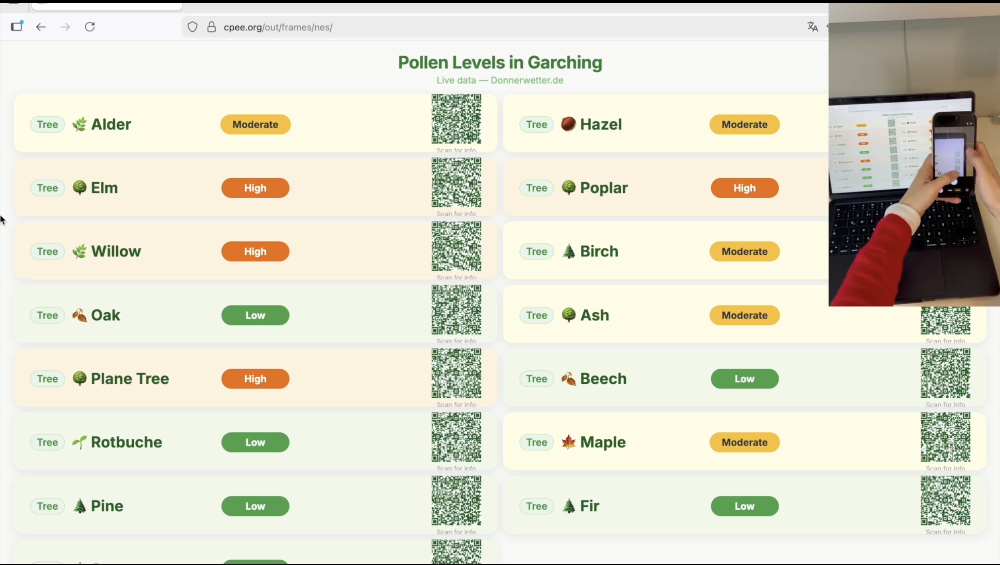

# Pollen Information System – Garching

This a a CPEE-driven web application that displays real-time pollen levels in Garching, detailed tree species information, and local plant observation photos. Users interact with the system through QR codes displayed on a tv screen. By scanning QR codes, users continue with the next page on CPEE workflow.

---

## System Overview

**CPEE Process Model:** [JoyPrak_Neslihan_main_branch.xml](JoyPrak_Neslihan_main_branch.xml)

## Demo

### Prepare and Finalize

Each CPEE node has two data-handling sections:

- **Prepare** — runs *before* the node executes. It is used to set up endpoints or pass data into the node. For example, `endpoints.frames_display += attributes.framesid` registers which browser frame this node should display its page in.
- **Finalize** — runs *after* the node receives a result (e.g. a QR code scan). The result returned by `send.php` is captured into an Access Variable and then stored in a CPEE data field so it can be used by later nodes.

### CPEE Node Screenshots

**a1 – Init Frame:** Initialises the browser frame. Prepare registers the frame endpoint (`endpoints.frames_init += attributes.framesid`) so later nodes know where to display content.

**a2 – Clear:** Clears the current display. Finalize sets `data.timeout = false` to reset the timeout flag at the start of each loop.

**a4 – Show QR:** Opens `pollen.html` and waits for the user to scan a QR code. When scanned, `send.php` sends the scientific name (e.g. `Salix`) back to CPEE. Finalize captures it as `result` and stores it in `data.wereceived`, which is then passed to the next nodes.

**a5 – Show individual page:** Opens `trees.html` passing `data.wereceived` as the `species` URL parameter, so the page knows which tree to look up. When the user scans a QR ("Go Home" or "See More Photos"), Finalize stores the result into `data.isHome`. The condition `data.isHome != "home" && !data.timeout` then determines whether to proceed to observations or loop back.

**a9 – Show observations:** Opens `observation.html` passing `data.wereceived` as the `taxon` URL parameter, so the page fetches photos of the same plant the user selected in a4.

**a3 – Wait 60 seconds:** Timeout node running in parallel with the user task nodes. If 60 seconds pass with no QR scan, Finalize sets `data.timeout = true` and the workflow loops back to the beginning.

---

## File Descriptions

### Display Pages

| File | URL Parameter | Purpose |
|------|--------------|---------|
| `pollen.html` | — |This is the main dashboard. It fetches live pollen data via `pollen_proxy.php`, which web-scrapes Donnerwetter.de in real time. Then, it displays a card per pollen type (level > 0) with its QR code. Adapts to 1 or 2 columns depending on item count. |
| `trees.html` | `?species=<name>` | This is the species detail page. It receives a pollen/tree name (based on the scanned qr code in pollen.html), queries the Trefle API via `tree.php`, and displays an information page. Always shows two QR codes: Go Home and See More Photos. |
| `observation.html` | `?taxon=<scientific_name>` | This is the photo gallery page. It takes a scientific genus name (e.g. `Salix`), fetches the 10 most recent research-grade observations from iNaturalist filtered to Munich (falls back to Germany if fewer than 4 Munich results), and displays them in a 5×2 photo grid. |

### PHP Backend Scripts
| File | Purpose |
|------|--------------|
| `pollen_proxy.php` |Fetches the pollen forecast from Donnerwetter.de and returns the data as JSON. It reads the HTML of the page, finds the pollen names and their levels, and translates them from German to English. Only pollen with a level above 0 is included. This runs on the server because browsers cannot contact Donnerwetter.de directly due to CORS restrictions.|
| `tree.php` | Server-side proxy for the Trefle plant database API. Takes a `?species=<name>` query parameter, forwards it to trefle.io/api, and returns the JSON response to the browser. This php backend is required because the Trefle API token must be kept server-side and cannot be exposed in client-side JavaScript.|
| `send.php` | CPEE callback relay. Takes `?info=<value>&cb=<url>` and does a PUT request to the CPEE callback URL with `info` as the plain-text body. This is how QR code scans communicate back to the CPEE engine. The CPEE engine then decides which page to show next based on its process model.|

---

## Possible Improvements

### Centralised Pollen Data Fetching in CPEE

Currently `pollen.html` fetches `pollen_proxy.php` directly from the browser, meaning Donnerwetter.de is scraped on every page load and `pollen.html` is tightly coupled to the proxy URL.

A cleaner architecture would be to add a dedicated **CPEE service call node** at the start of the workflow that fetches `pollen_proxy.php` once and stores the JSON result in a CPEE data field. CPEE would then pass this data to `pollen.html` as a URL parameter. The HTML page would simply read the data from the URL instead of fetching it itself.

Benefits:
- **Loosely coupled** — pages have no dependency on `pollen_proxy.php`; they only consume data provided by CPEE
- **Single fetch** — Donnerwetter.de is scraped once per workflow run, not once per page
- **Reusable** — the same pollen data can be passed to multiple CPEE nodes without re-fetching
- **Easier to swap** — the data source can be changed in one place (the CPEE service call) without touching any HTML

---

## External APIs Used

| API | Used By | 
|-----|---------|
| [Donnerwetter.de](https://www.donnerwetter.de/pollenflug/garching/DE16830.html) | `pollen_proxy.php` | 
| [Trefle API](https://trefle.io) | `tree.php` | 
| [iNaturalist API](https://api.inaturalist.org/v1) | `observation.html` | 
| [QRCode.js](https://cdnjs.cloudflare.com/ajax/libs/qrcodejs/1.0.0/qrcode.min.js) | All display pages | 

---

## Pollen Level Scale

| Level | Label | Color |
|-------|-------|-------|
| 1 | Low | Green |
| 2 | Moderate | Yellow |
| 3 | High | Orange |
| 4 | Very High | Red |

